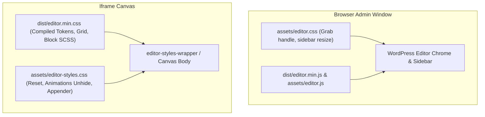

# Modern WordPress & ACF Block Editor Integration Guide

This guide documents the architecture and implementation for full-fidelity styling and JavaScript interactivity inside the modern WordPress (WP 6.x / 7.x+) Block Editor and ACF PRO. Use this guide to replicate the setup in other WordPress themes.

---

## 1. Architectural Overview

WordPress isolates the Gutenberg block editor canvas inside an `<iframe>`. Because of this separation, theme assets must be split into two contexts:



1. **Inside the Iframe Canvas**: Loaded via `add_editor_style()`. Styles the actual content, custom blocks, responsive grid, typography, and unhides scroll animations.
2. **Outside in Editor Chrome**: Loaded via `enqueue_block_editor_assets`. Manages admin sidebar width, ACF inspector panels, and draggable resize handles.
3. **Editor JavaScript**: Dispatched to re-run animations, sliders, and interactive block scripts upon ACF block preview re-renders (`render_block_preview`).

---

## 2. Build Pipeline: Dual Webpack Entry Points

Add a dedicated `editor` entry point alongside your frontend `main` entry point.

### `config/webpack.config.js`
```javascript
const path = require("path");
const MiniCssExtractPlugin = require("mini-css-extract-plugin");
const TerserPlugin = require("terser-webpack-plugin");

const config = (dir = __dirname, mode = 'production') => ({
    entry: {
        main: "./src/main.js",
        editor: "./src/editor.js",
    },
    output: {
        path: path.resolve(dir, "./dist"),
        filename: "[name].min.js",
        chunkFilename: "[name].min.js"
    },
    externals: {
        $: "jQuery",
        jquery: "jQuery",
        "window.jQuery": "jQuery",
        jQuery: "jQuery"
    },
    optimization: {
        minimize: mode === 'production',
        minimizer: [new TerserPlugin({ extractComments: false })],
        splitChunks: {
            cacheGroups: {
                commons: {
                    test: /[\\/]node_modules[\\/]/,
                    name: 'vendors',
                    // Vendor chunk is scoped to frontend main only
                    chunks: chunk => chunk.name === 'main'
                }
            }
        },
    },
    plugins: [
        new MiniCssExtractPlugin({
            filename: "[name].min.css",
            chunkFilename: "[id].css",
        }),
    ],
    module: {
        rules: [
            {
                test: /\.s[ac]ss$/i,
                use: [
                    MiniCssExtractPlugin.loader,
                    {
                        loader: 'css-loader',
                        options: { url: false },
                    },
                    {
                        loader: "sass-loader",
                        options: {
                            sassOptions: {
                                loadPaths: [
                                    path.resolve(dir, "./src/scss/include"),
                                    path.resolve(dir, "./node_modules"),
                                ],
                            },
                        },
                    },
                ],
            },
        ],
    },
});

module.exports = config;
```

---

## 3. Editor Stylesheet & Colocated SCSS Bundling

### `src/editor.js`
This file serves as the JS/SCSS bundle entry for the editor. It automatically discovers and imports any `_*.scss` partials within your blocks and components directories.

```javascript
import 'slick-carousel/slick/slick.scss';
import 'slick-carousel';
import $ from 'jquery';
import { initSlider } from './js/modules/vendor/slider';

import './scss/editor.scss';

// Auto-import every _*.scss inside blocks/*/ so block styles cascade in the editor iframe
const blockStyles = require.context('../blocks', true, /_[^/]+\.scss$/);
blockStyles.keys().forEach(blockStyles);

// Auto-import every _*.scss inside components/*/
const partStyles = require.context('../components', true, /_[^/]+\.scss$/);
partStyles.keys().forEach(partStyles);

// Re-initialize dynamic JS (e.g. Slick sliders) when ACF re-renders a preview
if (window.acf) {
    window.acf.addAction('render_block_preview', function ($block) {
        initSlider($block);
    });
}

// Initial DOM check on load
$(function () {
    initSlider();
});
```

### `src/scss/editor.scss`
Mirror your design tokens, grid layout, reset rules, and typography into the editor bundle:

```scss
@use 'include/_fonts';
@use 'include/_reset';
@use 'include/_typography';
@use 'include/_layout';
@use 'include/_smooth-scroll';
@use 'include/_animations';
@use 'include/_helpers';

@use 'global/_buttons';
@use 'global/_form';
```

---

## 4. Canvas Overrides & Resets (`assets/editor-styles.css`)

Create a dedicated stylesheet for rules that apply strictly inside the editor canvas:

```css
/* ─── Canvas Chrome & Grid Width ─── */
.wp-block {
    max-width: 100% !important;
}

.wp-block-post-content,
.editor-styles-wrapper .wp-block-post-content,
.editor-styles-wrapper .block-editor-block-list__layout {
    max-width: none !important;
    width: 100% !important;
}

body.editor-styles-wrapper {
    background-color: #fff !important;
    padding: 0 !important;
    line-height: 1.5 !important;
    overflow-x: visible !important;
}

/* ─── ACF Block Field Box Styling ─── */
.acf-block-body .acf-block-fields,
.acf-block-component .acf-fields {
    border: 2px solid #000 !important;
    border-radius: 10px;
}

/* ─── Force Animated Elements Visible in Editor ─── */
/* Prevents elements using IntersectionObserver from staying invisible */
.fade-in,
.fade-up,
.img-up,
.img-show img,
[data-scroll] {
    opacity: 1 !important;
    transform: none !important;
    scale: 1 !important;
}

.split-line,
.split-line__inner,
.split-text__word,
.split-text__word__inner {
    opacity: 1 !important;
    transform: none !important;
}

/* ─── Disable Sticky & Parallax In Editor Canvas ─── */
.hero,
[data-parallax-root],
[data-parallax-speed] {
    position: relative !important;
    transform: none !important;
}

/* ─── Block Inserter (+) Appender Visibility ─── */
.block-list-appender,
.block-editor-block-list__layout > .block-list-appender,
.wp-block-post-content > .block-list-appender,
.editor-styles-wrapper .block-list-appender {
    opacity: 1 !important;
    visibility: visible !important;
    display: block !important;
    pointer-events: auto !important;
    margin-top: 40px !important;
    padding: 16px 0 !important;
    border-top: 1px dashed rgba(0, 0, 0, 0.15) !important;
}
```

---

## 5. WordPress Theme Registration (PHP)

Add the following configuration in your theme includes (e.g., `include/acf.php` or `functions.php`).

```php
<?php
defined('ABSPATH') || exit;

/**
 * 1. Register styles loaded INSIDE the block editor iframe.
 */
add_action('after_setup_theme', function () {
    add_theme_support('editor-styles');

    // Hand-crafted editor canvas overrides
    add_editor_style('assets/editor-styles.css');

    // Compiled SCSS bundle mirroring frontend styling
    if (file_exists(get_template_directory() . '/dist/editor.min.css')) {
        add_editor_style('dist/editor.min.css');
    }
});

/**
 * 2. Enqueue styles and JS for outer editor UI and live block scripts.
 */
add_action('enqueue_block_editor_assets', function () {
    $css_path       = get_template_directory() . '/assets/editor.css';
    $js_path        = get_template_directory() . '/assets/editor.js';
    $dist_editor_js = get_template_directory() . '/dist/editor.min.js';

    if (file_exists($css_path)) {
        wp_enqueue_style(
            'theme-editor-chrome',
            get_template_directory_uri() . '/assets/editor.css',
            [],
            filemtime($css_path)
        );
    }

    if (file_exists($js_path)) {
        wp_enqueue_script(
            'theme-editor-chrome',
            get_template_directory_uri() . '/assets/editor.js',
            [],
            filemtime($js_path),
            true
        );
    }

    if (file_exists($dist_editor_js)) {
        wp_enqueue_script(
            'theme-editor-bundle',
            get_template_directory_uri() . '/dist/editor.min.js',
            ['jquery', 'wp-blocks', 'wp-dom-ready', 'wp-edit-post', 'wp-data', 'wp-element'],
            filemtime($dist_editor_js),
            true
        );
    }
});
```

---

## 6. ACF `block.json` Manifest & Auto-Discovery

Structure each block under `blocks/{slug}/` with a `block.json` using WordPress Block API v3.

### `blocks/hero/block.json`
```json
{
    "$schema": "https://schemas.wp.org/trunk/block.json",
    "apiVersion": 3,
    "name": "acf/hero",
    "title": "Hero",
    "description": "Hero header block",
    "category": "content",
    "icon": "superhero",
    "keywords": ["hero", "header"],
    "textdomain": "my-theme",
    "supports": {
        "jsx": true,
        "align": false,
        "anchor": true
    },
    "acf": {
        "mode": "auto",
        "renderTemplate": "hero.php"
    }
}
```

### Auto-Registration in PHP
```php
function theme_register_blocks_from_json() {
    $blocks_dir = get_template_directory() . '/blocks';
    if (!is_dir($blocks_dir)) {
        return;
    }

    foreach (glob($blocks_dir . '/*/block.json') as $manifest) {
        register_block_type(dirname($manifest));
    }
}
add_action('init', 'theme_register_blocks_from_json');
```

---

## 7. Dynamic JS Teardown and Re-Init Pattern

Because ACF re-renders preview HTML via AJAX when fields change, dynamic JS components must clean up old instances before re-initializing.

```javascript
import $ from 'jquery';

export function initSlider(context = document) {
    const $context = $(context);
    const $sliders = $context.hasClass('image-slider__slider')
        ? $context
        : $context.find('.image-slider__slider');

    if (!$sliders.length) return;

    $sliders.each(function() {
        const slider = $(this);

        // Teardown existing instance if re-rendering inside Gutenberg
        if (slider.hasClass('slick-initialized')) {
            slider.slick('unslick');
        }

        slider.slick({
            infinite: true,
            slidesToShow: 1,
            slidesToScroll: 1,
            arrows: true,
            draggable: true
        });
    });
}
```

---

## 8. Full-Width Canvas `theme.json` Configuration

Add a minimal `theme.json` to prevent core WordPress layout constraints from overriding your grid container widths:

### `theme.json`
```json
{
    "$schema": "https://schemas.wp.org/trunk/theme.json",
    "version": 3,
    "settings": {
        "appearanceTools": false,
        "useRootPaddingAwareAlignments": false,
        "layout": {
            "contentSize": "100%",
            "wideSize": "100%"
        }
    }
}
```

---

## 9. Implementation Checklist

- [ ] **Dual Webpack Configuration**: Add `editor: "./src/editor.js"` entry point to Webpack.
- [ ] **Editor Entry Point**: Create `src/editor.js` and import `src/scss/editor.scss`.
- [ ] **Auto-Discovery of Styles**: Add `require.context` calls in `src/editor.js` to auto-import `blocks/*/_*.scss` and `components/*/_*.scss`.
- [ ] **Editor Canvas CSS**: Create `assets/editor-styles.css` with container resets, animation overrides, and inserter button fixes.
- [ ] **Theme Support**: Hook `add_theme_support('editor-styles')` and `add_editor_style()` on `after_setup_theme`.
- [ ] **Enqueue Scripts**: Enqueue `dist/editor.min.js` on `enqueue_block_editor_assets` with standard Gutenberg dependencies.
- [ ] **Block JSON API v3**: Place blocks in `blocks/{slug}/block.json` with `"apiVersion": 3` and register using `register_block_type()`.
- [ ] **ACF Preview Hook**: Add `window.acf.addAction('render_block_preview', ...)` in `src/editor.js` for interactive JS components.
- [ ] **Theme JSON**: Define `theme.json` with `"contentSize": "100%"` and `"wideSize": "100%"`.
